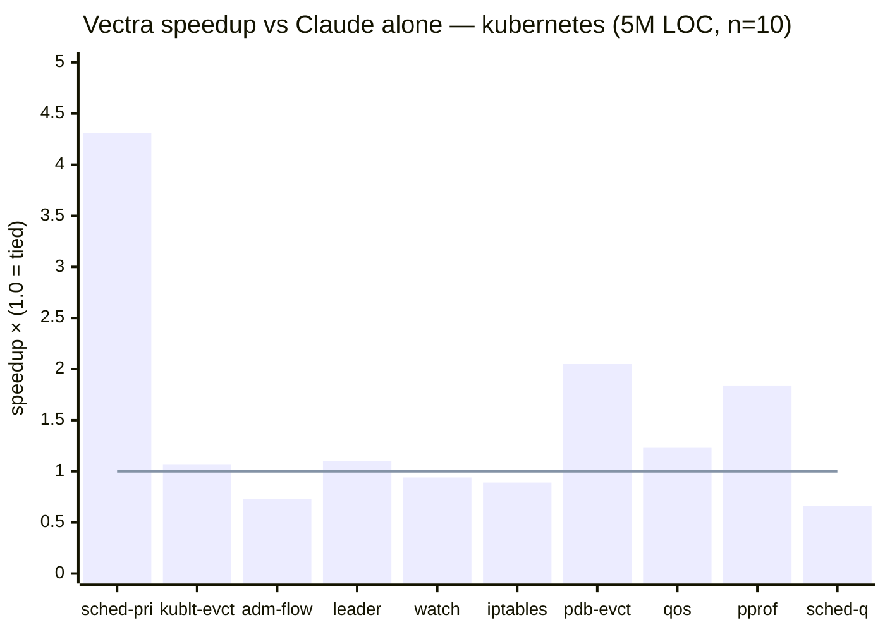
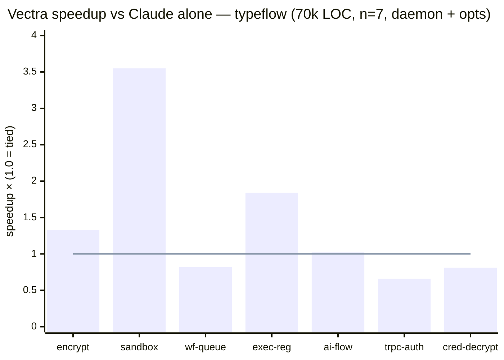

# Vectra

**Local-first code RAG that dispatches to Claude Code.** Vectra indexes
your repo with tree-sitter (33 languages), embeds it on-device via
llama.cpp, retrieves with hybrid vector + symbol search and an optional
cross-encoder reranker, and hands the top-K chunks to `claude -p` as
labeled context. Claude Code does the editing through its own tools;
Vectra never touches files on its own. No cloud, no telemetry, single
binary.

> **Status:** 0.6.0 — usable end-to-end via the VS Code extension or the
> CLI. See [`CHANGELOG.md`](./CHANGELOG.md) for what's in the current
> release and [`architecture.md`](./architecture.md) for the design.

## Does it actually help?

Two head-to-head benchmarks against `claude -p` running alone in the
same repo. Both pipelines answer the same research questions; the only
difference is whether Vectra pre-fetches the relevant chunks or Claude
discovers them itself via `Glob` / `Grep` / `Read`. Same Claude model,
same temperature, same `--permission-mode plan`. Full data and harness
in [`benchmarks/proof-of-concept/`](./benchmarks/proof-of-concept/).

| Repo | Size | Vectra Σ time | Claude alone Σ time | Aggregate speedup | Best single task |
|---|---|---:|---:|---:|---:|
| **typeflow** (private TS / Next.js workflow tool) | 70k LOC, ~1k files | **285 s** | 331 s | **1.16×** | 3.55× (sandbox) |
| **[kubernetes/kubernetes](https://github.com/kubernetes/kubernetes)** | **5M LOC, ~17k files** | **1149 s** | 1400 s | **1.22×** | **4.31×** (scheduler-priority) |

Cost is roughly flat on both: −5 % on kubernetes, +6 % on typeflow.
Quality is a wash — Vectra and Claude alone hit the same verifier
anchors on every passing task. **The wall-clock saving comes from
Vectra eliminating the grep-spelunking phase Claude does when it has
to discover the repo from scratch.**

### Per-task — kubernetes (5M LOC)



Bars above 1.0 = Vectra wins. **Vectra wins 6 / 10 tasks**, with
three runaway wins (`scheduler-priority` 4.3×, `pdb-eviction` 2.0×,
`pprof-routes` 1.8×). Claude alone wins 4 (`admission-flow`,
`apiserver-watch-cache`, `iptables-proxier-sync`, `scheduler-queue`),
all by less than 35 %. Vectra's wins are bigger than its losses —
which is why the aggregate speedup is positive even though the per-task
record is mixed.

### Per-task — typeflow (70k LOC)



Vectra wins 3 / 7 (sandbox 3.5×, executor-registry 1.8×, encryption 1.3×),
ties 1, loses 3. The losses are on queries with very specific keyword
matches where Claude's own `Grep` is direct-hit (`tf-trpc-auth`,
`tf-credential-decrypt`).

### Why the gap widens on bigger codebases

The single biggest Vectra win is `scheduler-priority` on kubernetes —
**4.3×** faster wall-clock. That task asks "where is a Pod's priority
used to decide which existing pods to preempt when there is no room?".
Claude alone has to search through 17 000 Go files: `Glob` for
priority-related filenames, `Grep` for `Preempt`, `Read` likely
candidates, repeat. Vectra's symbol-search lands on
`pkg/scheduler/framework/plugins/defaultpreemption/default_preemption.go`
in a single FTS5 query (39 ms) and Claude's first turn is the answer.

Both benchmarks show Vectra's median speedup grows with codebase size.
The 70k-LOC repo gives 1.16× aggregate; the 5M-LOC repo gives 1.22×
**with the weakest Vectra config (symbol-only, no embedder, no
daemon)**. The hand-off cost is a constant — the savings scale with
how many `Grep` rounds Claude would otherwise do.

The harness, raw NDJSON streams, extracted answers, per-task `meta.json`
(input/output tokens, cost, duration), and the side-by-side render
script all live in [`benchmarks/proof-of-concept/`](./benchmarks/proof-of-concept/).
Reproducing on your own repo is `vectra index . && KUBE_DIR=$(pwd)
RUNS_DIR_OVERRIDE=… ./run-poc.sh` plus a `tasks-yourrepo.json`.

> **Caveats up front.** Both benches are small (n = 7 and n = 10), one
> repo each, both research-style questions in plan mode. Edit-task data
> is mixed (Vectra was +38% slower / +65% pricier than Claude alone on
> 5 kubernetes edit-tasks where the file path was already in the prompt).
> Treat the headline numbers as directional, not contractual.

## Why Vectra

Existing code assistants either ship your code to a remote API or run a
generic embedding model that doesn't understand code structure. Vectra
treats code as a structured object: AST-aware chunking, symbol-level
hybrid retrieval that combines semantic similarity with exact
identifier matches, and a tight handoff to Claude Code for the actual
editing. Retrieval is Vectra's job; editing is Claude's.

Read the full architecture in [`architecture.md`](./architecture.md).

## Supported Platforms

| Tier | Platforms |
|------|-----------|
| **Tier 1** (CI + prebuilt binaries) | Linux x86_64 · Linux ARM64 · macOS ARM64 · macOS x86_64 · Windows x86_64 |
| **Tier 2** (build-tested)           | Windows ARM64 · FreeBSD |

GPU acceleration via llama.cpp: CUDA, ROCm/HIP, Metal, Vulkan.
CPU fallback with AVX2 / NEON.

## Building from source

### Prerequisites

- **CMake** 3.25 or newer
- **Ninja** (recommended) or Visual Studio 2022
- A C++20 compiler: Clang 16+, GCC 13+, or MSVC 19.36+
- **vcpkg** (set `VCPKG_ROOT` to its install path)
- **Git** with submodule support

### Quick build

```bash
git clone --recurse-submodules https://github.com/HenryBuilds/Vectra.git
cd Vectra

# Configure + build (pick the preset matching your platform)
cmake --preset release
cmake --build --preset release

# Run tests
ctest --preset release
```

### Available presets

| Preset | Description |
|--------|-------------|
| `debug` / `release` / `relwithdebinfo` | Generic single-config builds |
| `linux-clang-release` / `linux-gcc-release` | Linux with explicit compiler |
| `macos-clang-release` | macOS (Apple Silicon or Intel) |
| `windows-msvc-release` / `windows-clang-release` | Windows with MSVC or clang-cl |
| `asan` / `tsan` | Sanitizer builds (Unix only) |
| `linux-clang-cuda-release` / `linux-gcc-cuda-release` | Linux + CUDA, multi-arch redistributable (Turing → Blackwell) |
| `windows-msvc-cuda-release` | Windows + CUDA, same multi-arch list |
| `macos-clang-metal-release` | macOS + Metal (explicit; equivalent to the auto-detect default on macOS) |
| `linux-clang-rocm-release` | Linux + HIP/ROCm (AMD) |
| `linux-clang-vulkan-release` | Linux + Vulkan (cross-vendor fallback) |

### GPU acceleration

Vectra builds the embedding model through llama.cpp / ggml, which
ships backends for CUDA, Metal, HIP/ROCm, and Vulkan. **Vectra
auto-detects the right one at configure time** — you usually do
not need a flag.

The probe runs once per fresh configure (`build/<preset>/CMakeCache.txt`
remembers the choice afterwards) and follows this order:

| Platform | First match wins |
|----------|------------------|
| **macOS** (Apple Silicon + Intel) | Metal |
| **Linux / Windows** | CUDA Toolkit → ROCm/HIP → Vulkan SDK → CPU |

Watch the configure output for the resolved choice:

```
-- vectra: auto-detected CUDA Toolkit 12.8 — enabling CUDA backend
-- ...
-- Vectra 0.0.1
--   GPU backend  : CUDA
```

**Overrides** (any time you want something other than auto):

```bash
# Force a specific backend (skips probe):
cmake --preset release -DVECTRA_GPU_CUDA=ON
cmake --preset release -DVECTRA_GPU_METAL=ON
cmake --preset release -DVECTRA_GPU_VULKAN=ON
cmake --preset release -DVECTRA_GPU_HIP=ON

# Force CPU-only even on a GPU machine:
cmake --preset release -DVECTRA_AUTO_GPU=OFF

# Pick CUDA on a machine that also has Vulkan / ROCm installed
# (CUDA already wins by probe order; this just makes it explicit):
cmake --preset release -DVECTRA_GPU_CUDA=ON
```

**CUDA notes.** CUDA architecture selection is delegated to llama.cpp's
ggml-cuda CMakeLists, which auto-targets the host GPU when
`GGML_NATIVE=ON` (the default for native builds). For redistributable
binaries, override with a multi-arch list, e.g.:

```bash
cmake --preset release -DVECTRA_GPU_CUDA=ON \
    -DCMAKE_CUDA_ARCHITECTURES="75-virtual;86-real;89-real;120a-real"
```

This covers Turing → Blackwell with one binary. CUDA Toolkit 12.8+ is
required for Blackwell (RTX 50-series) FP4 tensor cores; older
toolkits skip the `120a-real` arch automatically.

**Skipping the embedder.** If you only work on the CLI / store / core
modules and don't want a 10–15-minute first build, pass
`-DVECTRA_BUILD_EMBED=OFF`. Vectra falls back to symbol-only retrieval
(FTS5 + tree-sitter), which works without any GPU or embedding model.

## Repository layout

```
vectra/
├── architecture.md          Design document (start here)
├── languages.toml           Language registry (data-driven, no C++ changes)
├── CMakeLists.txt           Top-level build
├── CMakePresets.json        Cross-platform build presets
├── vcpkg.json               Manifest dependencies
├── cmake/                   Reusable CMake helpers (e.g. TreeSitterGrammar)
├── queries/<lang>/          Tree-sitter queries: chunks, symbols, imports
├── adapters/                Build-tool manifests: cargo, cmake, npm, ...
├── third_party/             Pinned submodules
│   ├── llama.cpp/           Inference runtime (embeddings + generation)
│   ├── tree-sitter/         Parser runtime
│   ├── usearch/             HNSW vector index (header-only)
│   └── grammars/            Per-language tree-sitter grammars
├── src/
│   ├── core/                Tree-sitter chunking, Merkle index
│   ├── store/               SQLite + usearch persistence
│   ├── embed/               llama.cpp embedding wrapper
│   ├── retrieve/            Hybrid query path + reranker
│   └── cli/                 Subcommands: index, search, ask, model
├── include/vectra/          Public headers
├── tests/                   Catch2 unit tests
└── benchmarks/              google/benchmark perf tests
```

### Cloning with submodules

Vectra vendors `llama.cpp`, `tree-sitter`, `usearch`, and 33
tree-sitter grammars as git submodules under `third_party/`. Always
clone with submodules:

```bash
git clone --recurse-submodules https://github.com/HenryBuilds/Vectra.git
```

If you cloned without `--recurse-submodules`, run:

```bash
git submodule update --init --recursive
```

## Troubleshooting

### "Model not cached" when running `vectra ask --model …`

Vectra resolves model names through llama.cpp's GGUF model store
(`~/.cache/llama.cpp` on Linux/macOS, `%LOCALAPPDATA%\llama.cpp` on
Windows). If the model isn't already on disk, the CLI prints a
"model not cached" error instead of silently downloading. Fix:

```bash
vectra model pull qwen3-embedding-0.6b
# Or, if you want the reranker:
vectra model pull qwen3-reranker-0.6b
```

The VS Code extension auto-pulls the embedding model on first
`reindex-with-model` so users typically don't see this. If the pull
itself fails, check connectivity to `huggingface.co` — the registry
is HF Hub.

### GPU not detected at configure time

`cmake --preset release` probes for CUDA → ROCm/HIP → Vulkan and
flips `VECTRA_GPU_*` automatically. If it falls through to CPU on
a machine with a GPU, the most common causes:

- **CUDA**: `CUDAToolkit_ROOT` / `CUDA_PATH` not on PATH. Check
  `nvcc --version` works from the same shell.
- **ROCm**: `hip` package not exporting a CMake config — install
  `rocm-cmake` and set `CMAKE_PREFIX_PATH=/opt/rocm`.
- **Vulkan**: SDK installed but `VULKAN_SDK` not exported.

Force a backend explicitly to skip the probe:

```bash
cmake --preset release -DVECTRA_GPU_CUDA=ON      # or _METAL/_HIP/_VULKAN
```

Verify the result by grep'ing the configure log for `GPU backend  :`
or by running `vectra ask --model qwen3-embedding-0.6b "test"` and
watching for `ggml_cuda_init: found N CUDA devices` in stderr. If
the embedder loads but no CUDA line appears, the binary was linked
without the GPU backend — re-configure with the explicit preset.

### Permission modal hangs in the VS Code extension

`ask` mode routes every Edit / Write / Bash through an in-chat
approval modal with a 90-second timeout. If the modal never shows
up at all, the `claude` ↔ MCP ↔ host bridge has lost a hop. Check
the **Vectra** output channel (View → Output → Vectra) — every hop
logs there. Common fixes:

- A previous `vectra ask` left the chat in a stuck state: click
  "+ New chat" to spawn a fresh subprocess.
- Re-install the VSIX after upgrading; old bridge versions don't
  match the current MCP wire shape.
- Switch the mode picker to `auto` to bypass approvals while
  debugging the bridge.

### Claude says it edited a file but nothing changed

Claude Code occasionally narrates an edit ("I've updated the
import …") in plain text without actually emitting an Edit /
Write / MultiEdit tool call. The webview detects this heuristically
and surfaces a yellow warning banner. When you see it: re-prompt
with "actually run the Edit tool — don't just describe it" and the
next turn usually goes through.

### Stale VSIX after a Vectra upgrade

After installing a new VSIX, **fully reload the window** (`Developer:
Reload Window` in the command palette) — VS Code keeps the old host
process running otherwise, and you'll see pre-upgrade behaviour.

### Windows build: STL link errors / `nvcc: A single input file is required`

See [`architecture.md`](./architecture.md) → *Build-time toolchain
pitfalls (Windows)* for the exhaustive list. Short version: build
from a VS 18 developer command prompt with Ninja, and pass
`-DCMAKE_CUDA_FLAGS=-allow-unsupported-compiler` for CUDA on a VS 18
host until you upgrade to CUDA Toolkit 12.8+.

## License

Apache-2.0. See [`LICENSE`](./LICENSE).

## Contributing

See [`CONTRIBUTING.md`](./CONTRIBUTING.md).
