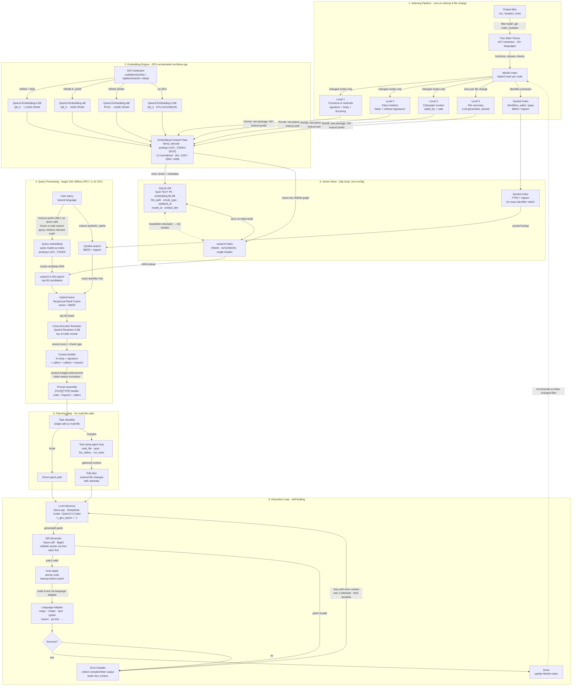

## Notes on key design decisions

**Pooling strategy.** Qwen3-Embedding is trained with last-token (EOS) pooling. Mean pooling silently degrades retrieval quality by 5–15% on code benchmarks — we use last-token pooling end-to-end.

**Asymmetric instruct prefix.** Qwen3-Embedding expects an instruction prefix on the **query** side only. Documents (code chunks) are embedded as raw passages. Mixing this up makes the model perform worse than no prefix at all.

**Quantization.** Generation models tolerate Q4_K_M well. Embedding models do not — Q4 collapses the fine-grained similarity geometry that retrieval depends on. We use Q8_0 minimum, FP16 for the 8B model where VRAM allows.

**Hybrid retrieval.** Pure vector search misses exact identifier matches (function names, file paths, error strings). The BM25/trigram symbol index runs in parallel and is fused via Reciprocal Rank Fusion before reranking.

**Cross-encoder reranker.** Heuristic reranking on "recency" is a weak signal for code relevance. Qwen3-Reranker-0.6B reorders the top-50 candidates by true semantic match against the query, which is where most quality gains live.

**Index migration.** Embedding dimension is tied to model size. The SQLite schema records `model_id` and `embed_dim`; on mismatch we trigger a full reindex rather than silently mixing geometries.

**Planning step.** Trivial single-file edits go straight to the patch path. Anything multi-file routes through a tool-using agent loop (read_file, grep, list_callers, run_tests) before generating a structured edit plan.

**Language adapters.** The self-healing loop needs structured build/test output per language. Adapters wrap cargo/cmake/npm/pytest/maven/go test/etc. and normalize errors into a common retry-context format.

**Realistic latency.** End-to-end query (embed + ANN + rerank + context build) is 150–300ms on GPU, 1–2s on CPU. The previous <50ms target was not achievable with a real embedding model in the loop.
