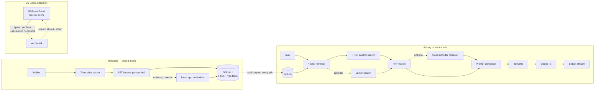

# Vectra architecture

**Local-first code RAG that dispatches to Claude Code.** Vectra walks
your repo with tree-sitter, stores chunks (and optionally embeddings)
in a single SQLite file, and hands top-K retrieval results to
`claude -p` as labeled context. Claude Code does the actual code
editing through its own tools; Vectra never touches files on its own.

There is no daemon, no service, no telemetry. The "vector store" is a
file on disk. Every command is a one-shot process.

## System overview



## Components

### 1. Indexing — `vectra index <root>`

Code path: [`src/cli/walker.cpp`](src/cli/walker.cpp), [`src/cli/index_command.cpp`](src/cli/index_command.cpp), [`src/core/`](src/core/), [`src/store/`](src/store/).

- Walker enumerates the project tree. Inside a git working tree
  it shells out to `git ls-files --cached --others
  --exclude-standard` and uses the result as the file set, so
  `.gitignore` (at any depth), `.git/info/exclude`, and the user's
  global gitignore are all honoured for free without any
  pattern-parsing on our side. Outside a git repo it falls back to
  a recursive directory iterator with a small universal-skip list
  (`.git`, `node_modules`, `__pycache__`, `target`, `build`,
  `dist`, `out`, `vendor`, plus the Vectra state dirs). The
  framework-specific entries the fallback used to carry (`.next`,
  `.turbo`, `.svelte-kit`, …) are gone — they are reliably in
  every modern project's `.gitignore` so the git path skips them
  automatically. A real bonus of this switch: `.env*` files drop
  out by default, closing a secret-leak vector where API keys
  could otherwise land in the embedding index and be sent to
  claude as context.
- Tree-sitter parses each supported file into an AST. The current
  language set (33 grammars, registered in [languages.toml](languages.toml))
  spans systems (C, C++, Rust, Go, Zig), scripting (Python, Ruby,
  Lua, Bash, R), JVM (Java, Kotlin, Scala, Clojure), web (JS, TS,
  TSX, HTML, CSS, PHP, Dart), functional (Haskell, OCaml, Elixir),
  config/data (JSON, YAML, TOML, Dockerfile, HCL, Make, SQL), and
  docs (Markdown). Unparseable files fall through to a whole-file
  chunk so they still show up in FTS5.
- The chunker emits one chunk per top-level symbol (function, class,
  method, namespace block) with line ranges and the symbol name.
- Each chunk is hashed (blake3, file-content level) and persisted to
  `<root>/.vectra/index.db`. Re-indexes are incremental at the file
  level: when a file's blake3 hash matches the prior run, the file
  is skipped entirely.
- If `--model <name>` is passed, the indexer loads a llama.cpp
  embedder up front, walks files as usual, and at the end runs a
  *backfill pass*: `Store::chunks_missing_embedding(model_id)`
  returns every chunk that has no vector for the active model;
  these are batched through `Embedder::embed_documents` (batch
  size 32) and persisted via `Store::put_embedding`. The single
  backfill call covers two cases at once:
  1. Turning a previously symbol-only index into a hybrid one —
     every chunk is missing, all get embedded.
  2. Incrementally updating an already-embedded index — only
     chunks added by this run are missing, the rest are skipped.
- Without `--model`, indexing is symbol-only — much faster, no
  model load, no GPU. The retriever still works in this mode; it
  just falls back to FTS5 over symbols and chunk text.
- **Model swap is not supported in place.** Mixing two embedding
  models in the same index is technically possible at the row
  level but the in-memory usearch HNSW shares one geometry, and
  `put_embedding` rejects dim mismatches. To switch models, delete
  `.vectra/index.db` and re-index from scratch.
- **Auto-indexer (extension only).** The VS Code extension owns a
  `FileSystemWatcher` that fires on file create / change / delete
  inside the workspace, debounces ~2s, and triggers a `vectra index`
  re-run on the affected paths. Concurrent runs are serialized
  through an in-process FIFO mutex (`indexLock`) — overlapping
  saves coalesce into one queued re-index instead of stomping on
  each other's WAL. The CLI itself has no watcher; one-shot
  invocations are still the model.

### 2. Storage — a single SQLite file

Code path: [`src/store/`](src/store/).

- One file: `<root>/.vectra/index.db`.
- Schema: chunks table (file, line range, symbol, kind, text body,
  blake3 hash), FTS5 virtual table over symbols and text for keyword
  search, optional vector table (model id + embedding blob + dim).
- SQLite is embedded — no server, no port, no auth. Multiple
  readers can open the file concurrently (WAL mode).
- Schema migrations are tracked in [`src/store/schema.cpp`](src/store/schema.cpp).
  Mismatched embedding model or dim triggers a full re-index rather
  than silently mixing geometries.

### 3. Retrieval — `vectra ask` and `vectra search`

Code path: [`src/retrieve/retriever.cpp`](src/retrieve/retriever.cpp), [`src/cli/ask_command.cpp`](src/cli/ask_command.cpp).

Two-stage hybrid pipeline:

1. **Symbol search (always on).** FTS5 query against symbol names
   and chunk text. BM25-ranked. ~1–10ms on a medium repo.
2. **Vector search (optional).** When the index has embeddings,
   the query is embedded with the same model and matched against
   the vector table by cosine similarity. ~10–50ms after the
   embedder is loaded.
3. **RRF fusion.** Reciprocal Rank Fusion merges the two rankings
   into a single ordering. No tunable weights — RRF is robust to
   score-range mismatches between BM25 and cosine.
4. **Cross-encoder rerank (optional).** When `--reranker` is set,
   Qwen3-Reranker-0.6B re-scores the top-K candidates by full
   query-chunk pairs. This is where most quality lives, but it
   doubles latency, so it's opt-in.
5. **Materialize.** Top-K chunks are loaded with their full text
   for the prompt composer.

Per-stage timings stream to stderr as `[ N ms] stage_name (count
items)` so the user can see where the wall-clock budget went.

### 4. Dispatch to Claude — `vectra ask`

Code path: [`src/cli/claude_subprocess.cpp`](src/cli/claude_subprocess.cpp).

- Prompt composer (pure function, unit-tested) builds:
  ```
  TASK: <user task>

  <context file="..." lines="..." symbol="..." kind="...">
  <chunk body verbatim>
  </context>
  ...
  ```
- Prompt is written to a tempfile under the system temp dir
  (`<tmp>/vectra-prompts/...`), RAII-cleaned even on throw or
  signal.
- `claude -p < tempfile` is spawned via `popen` with the shell
  redirecting stdin from the tempfile. Stdout streams back to the
  caller; stderr passes through to the parent so claude's
  diagnostics surface inline.
- `ANTHROPIC_API_KEY` is unset in the subprocess shell so claude
  falls through to its OAuth login (Claude Pro/Max users would
  otherwise be blocked by a stale env-var key injected by their
  shell or a sibling tool).
- Forwarded flags: `--model`, `--effort`, `--session-id`,
  `--resume`, plus arbitrary `--claude-arg` pass-throughs.

### 5. GPU acceleration via dynamic backend loading

llama.cpp ships its GPU backends (`ggml-cuda.dll`, `ggml-vulkan.dll`,
`ggml-metal.dylib`, `ggml-hip.dll`) as **separate dynamic libraries**
that live next to the main executable. The CPU backend is statically
linked into `ggml.dll`; the rest are discovered and loaded at runtime
by `ggml_backend_load_all()`.

**Two non-obvious gotchas this caused while wiring up CUDA:**

1. **Dynamic discovery is opt-in.** `llama_backend_init()` does NOT
   auto-discover backend DLLs — it only initializes ggml's f16
   tables. If you forget to call `ggml_backend_load_all()` before
   creating a model, only the statically-linked CPU backend is
   registered, and llama.cpp silently runs everything on CPU even
   when `ggml-cuda.dll` is sitting right next to the binary. The
   embedder and reranker both call `ggml_backend_load_all()` once
   per process via `std::call_once` (see [src/embed/embedder.cpp](src/embed/embedder.cpp) /
   [src/embed/reranker.cpp](src/embed/reranker.cpp)).

2. **`n_gpu_layers` defaults to `-1`.** llama.cpp reads
   `n_gpu_layers` from its model params; `0` means "everything on
   CPU." [include/vectra/embed/embedder.hpp](include/vectra/embed/embedder.hpp) and the matching
   reranker config default this to `-1` ("offload as many layers as
   fit on the GPU"). On a CPU-only build llama.cpp silently caps the
   value at 0, so the GPU-aware default is safe in both build modes.

When CUDA is correctly wired, the embedder prints a one-line
detection log on first init:

```
ggml_cuda_init: found 1 CUDA devices (Total VRAM: 12226 MiB):
  Device 0: NVIDIA GeForce RTX 5070, compute capability 12.0, VMM: yes
```

Throughput on a 5070 + Qwen3-Embedding-0.6B is roughly **300–800
chunks/sec** end-to-end (tokenize + forward pass + L2-norm + SQLite
upsert). On CPU the same workload sits around 50–80 chunks/sec.

#### Auto-detection at configure time

`cmake --preset release` (no GPU preset chosen) probes the host:
`find_package(CUDAToolkit QUIET)`, then `find_package(hip CONFIG)`,
then `find_package(Vulkan)`, and on macOS the Metal framework. The
first one that succeeds flips the matching `VECTRA_GPU_*` cache
variable and `VECTRA_AUTO_GPU=ON` so subsequent configures stay
sticky. To force a specific backend, use the explicit preset
(`linux-clang-cuda-release`, `macos-clang-metal-release`, …) which
inherits the hidden `_gpu-cuda-multiarch` mixin and pins
`CMAKE_CUDA_ARCHITECTURES=75-virtual;80-virtual;86-real;89-real;120a-real` —
the same redistributable arch list ggml ships, covering Turing
through Blackwell.

#### Build-time toolchain pitfalls (Windows)

- **VS 18 dev shell is required.** CMake's MSVC detection trips
  over the VS 18 install path; use Ninja from a VS 18 developer
  command prompt to avoid STL link mismatches.
- **CUDA 12.6 + VS 18.** nvcc 12.6 only officially supports VS
  2017–2022, so on a VS 18 host you must pass
  `-DCMAKE_CUDA_FLAGS=-allow-unsupported-compiler` at configure
  time. CUDA 12.8+ would fix this natively.
- **`/Zc:char8_t-` must be `CXX`-only.** llama.cpp needs this MSVC
  flag for its `u8"..."` literals, but if it leaks into the CUDA
  compile pipeline nvcc misparses the `-Xcompiler /Zc:preprocessor
  /Zc:char8_t-` group as two input files (`nvcc fatal: A single
  input file is required ...`). The CMake fix:
  `target_compile_options(... PRIVATE $<$<COMPILE_LANGUAGE:CXX>:/Zc:char8_t->)`.
  Same shape for `-fno-char8_t` on Clang/GCC.

### 6. Conversation continuity — `--session-id` / `--resume`

`claude -p` is single-turn by default: each invocation is a fresh
Claude session. To make multi-turn chat work without redesigning
the wrapper, vectra forwards two claude flags:

| vectra flag | claude flag | When |
|---|---|---|
| `--session-id <uuid>` | `claude -p --session-id <uuid>` | First turn — assigns a fresh UUID |
| `--resume <uuid>` | `claude -p --resume <uuid>` | Follow-up turns — reattaches to the on-disk transcript |

Claude Code persists every session it sees to disk under its session
ID, so the same UUID across multiple `vectra ask` invocations gives
the user a real multi-turn conversation. Vectra never reads or
writes the transcript itself — it only forwards the UUID.

### 7. Stream-JSON wire format

Code path: [`src/cli/ask_command.cpp`](src/cli/ask_command.cpp), [`extension/vscode/src/chatProvider.ts`](extension/vscode/src/chatProvider.ts).

`vectra ask --stream-json` switches the assistant turn from plain
text on stdout to **newline-delimited JSON** events. This is what
the VS Code extension always uses — terminal users keep the text
default. The flag forwards three options to claude in lockstep:

- `--output-format=stream-json` — wire format
- `--include-partial-messages` — token-level deltas (otherwise
  events only fire per-block, which feels like batch output)
- `--verbose` — required by `--print` mode to actually emit the
  events instead of silently suppressing them as "internal"

Vectra piggybacks on the same NDJSON channel to inject its own
side-channel events. The first one is `vectra_event/context`,
emitted on stdout right before claude is spawned, carrying the
retrieved chunks (file path, line range, symbol, kind) as a JSON
list. UI clients use it to pre-render a Sources footer that fills
in while claude is still composing the answer below.

The full event vocabulary on stdout, in encounter order for one
turn:

| event | source | purpose |
|---|---|---|
| `vectra_event` (subtype `context`) | vectra | retrieved chunks list |
| `system` (subtype `init`) | claude | session_id, model, cwd |
| `stream_event` / `message_start` | claude | turn begins |
| `stream_event` / `content_block_start` | claude | new block (text / tool_use / thinking) |
| `stream_event` / `content_block_delta` | claude | append to current block |
| `stream_event` / `content_block_stop` | claude | block finished |
| `stream_event` / `message_delta` | claude | usage update |
| `stream_event` / `message_stop` | claude | turn ends |
| `assistant` | claude | full assistant message (re-emit, ignored) |
| `user` (with `tool_result` blocks) | claude | tool returned |
| `result` | claude | final usage / cost / duration |

Lines that fail JSON.parse are forwarded as plain text chunks so
that older claude binaries or pre-stream-json error output still
show up instead of being silently dropped.

### 8. VS Code extension

Code path: [`extension/vscode/`](extension/vscode/).

- A singleton `WebviewPanel` opened with `ViewColumn.Beside` — i.e.
  a normal editor tab next to the code, *not* a sidebar section.
  Same UX as Anthropic's official Claude Code extension.
- React webview (bundled by esbuild into `out/webview.js`) renders
  the chat. The host (TypeScript, in `chatProvider.ts`) owns the
  `vectra ask` subprocess per turn and parses claude's NDJSON
  stdout into typed messages it forwards to the webview via
  `postMessage`. Stderr (the retrieval pipeline summary) flows
  through unchanged as a "meta" line above the assistant body.
- The webview models each assistant turn as an ordered list of
  blocks (`text`, `tool_use`, `thinking`) plus optional `sources`
  and `usage`:
  - **Text blocks** stream in via `text_delta` events, accumulating
    into the visible body.
  - **Tool-use blocks** render as a collapsible badge with a
    running / ok / error status pill; expanding shows the tool's
    input JSON and (when settled) the matching `tool_result`. The
    user can see exactly which tools claude invoked and what came
    back.
  - **Thinking blocks** (extended-thinking output) collapse by
    default behind a dashed border so the answer stays prominent
    but is still auditable.
  - **Sources footer** (from `vectra_event/context`) lists each
    retrieved chunk as `<symbol> file:line` clickable to open the
    file at the chunk's start line.
  - **Usage line** (from `result`) shows token in / out, cached
    tokens, USD cost, and wall-clock duration in monospace.
- Session continuity is plumbed through:
  - On panel construction, generate a `crypto.randomUUID()`.
  - First send → spawn `vectra ask … --session-id <uuid>`.
  - Subsequent sends → spawn `vectra ask … --resume <uuid>`.
  - "+ New chat" → regenerate UUID, kill any running process.
- `retainContextWhenHidden: true` so toggling away from the tab
  doesn't lose the chat.
- Pattern-matched error surfacing: when `vectra ask` exits non-zero,
  the host inspects stderr for known patterns (no index, no project
  root, model not cached) and renders a structured error bubble
  with an action button (e.g. "Index this workspace" → invokes
  `vectra.index`).
- **Mode picker** — three permission modes selectable in the UI:
  - `auto` (default) — `--permission-mode bypassPermissions`,
    Claude edits without asking.
  - `ask` — every Edit / Write / MultiEdit / Bash routes through
    the in-chat approval modal (see below).
  - `plan` — `--permission-mode plan`, Claude proposes a plan and
    waits for the user to accept before any tool use.

#### Permission bridge (`ask` mode)

When the mode is `ask`, the host spawns Claude with
`--permission-prompt-tool mcp__vectra__request_permission` and
ships a stdio MCP server in `extension/vscode/scripts/mcp-permission-server.js`
as the `vectra` MCP. Claude routes every tool call through this
server, which forwards to a localhost HTTP bridge owned by the
host (random port, bearer-token authenticated, listens on `127.0.0.1`).

The flow per approval:

```
claude (subprocess)
  ↓  mcp__vectra__request_permission(toolName, input)
mcp-permission-server.js (stdio, child of claude)
  ↓  POST /request  (bearer auth)
permissionBridge.ts (host, HTTP localhost)
  ↓  postMessage({ type: 'permissionRequest', … })
PermissionModal.tsx (webview)
  ↑  user clicks Approve / Deny
  ↓  postMessage({ approved, … })
permissionBridge.ts
  ↓  HTTP response { behavior: "allow" | "deny", message? }
mcp-permission-server.js → claude
```

The wire format on the bridge → MCP hop is internal
(`{ decision, reason }`), translated to Claude's official
`{ behavior: "allow" | "deny", message? }` shape via an
`asClaudeVerdict()` helper before being returned to claude.
Approvals time out after **90 s** and fall through as a deny so
the user can't get stuck on a pending modal. The webview shows
a tool-aware preview (Edit → diff, Write → new contents, Bash →
command + risk classification) and an elapsed-seconds counter.

#### Edit-claim hallucination detection

Claude occasionally narrates an edit ("I've updated the import
…") in `text` blocks without actually emitting an `Edit` /
`Write` / `MultiEdit` `tool_use`. The webview heuristically
matches edit-claim verbs (DE + EN) in the assistant text and,
if no successful edit-shaped tool call is present in the same
turn, surfaces a yellow warning banner. Catches the failure
mode without blocking legitimate output.

## Process model

Vectra is a stateless one-shot CLI. There is no background process.

```
$ vectra ask "wo wird auth gemacht"
  └─ vectra (one-shot)
       ├─ open .vectra/index.db (read-only)
       ├─ retrieve top-K chunks
       ├─ write prompt to tempfile
       ├─ spawn claude -p (one-shot child)
       │    └─ stream stdout
       └─ exit
```

The VS Code extension is a wrapper that spawns this same pipeline
once per chat turn. There is no shared state between turns inside
vectra — only the on-disk session file owned by claude (keyed by
the UUID we forward) carries the conversation forward.

This is "local-first" the literal way: no service runs in the
background, nothing listens on a port, nothing is auth-gated, and
killing the process always cleans up.

## Design decisions

**Why one-shot, not a daemon.** A daemon would cache the embedder
and reranker (both llama.cpp GGUF) in RAM, killing the per-ask
model-load cost — 200ms for the 0.6B embedder on CPU, 1–3s for the
8B variant cold-loaded from a GGUF file, plus another 200–500ms for
the reranker. Today we load both per invocation. We accept that
cost because (a) symbol-only retrieval — the default — needs no
model load, (b) a daemon adds non-trivial IPC, lifecycle, and
crash-recovery surface, and (c) a single `crypto.randomUUID()`
already buys us the multi-turn UX a daemon would have given. See
*Deferred work* for when this trade may flip.

**SQLite over a vector DB service.** A separate vector DB (Qdrant,
Milvus, pgvector) would mean a daemon, a port, and a setup story.
SQLite + a vector table mirrored to usearch keeps the whole index
in one file the user can copy, gitignore, or delete with `rm -rf`.
Throughput is plenty for repo-scale retrieval — usearch's HNSW is
the same algorithm the dedicated DBs use.

**Hybrid retrieval.** Pure vector search misses exact identifier
matches (function names, file paths, error strings). Pure symbol
search misses paraphrases. Running both in parallel and fusing with
RRF is cheap and consistently outperforms either alone on code
benchmarks.

**Tempfile + popen, not stdin pipe.** `claude -p` could read the
prompt from stdin via a native pipe instead of a shell redirect.
The win is one less filesystem round-trip per turn. The cost is
~150 lines of cross-platform `CreateProcess` / `posix_spawn` code
plus Windows `.cmd` resolution, which carries real regression risk
for negligible speedup at our prompt sizes (low-KB). Deferred.

**`git ls-files` for the walker, not a homegrown `.gitignore`
parser.** A correct `.gitignore` implementation handles glob
patterns, anchored vs unanchored, dir-only trailing slash,
negation, multi-level files at every directory depth,
`.git/info/exclude`, and the user's global gitignore. That's a
800–1500-LOC vendored library or a hand-rolled parser of similar
size. Shelling out to `git ls-files` gets all of that for free
because git itself is doing the work — at the cost of a fork+exec
per index run (~10–50ms one-shot, irrelevant at indexing-time
scale) and a hard dependency on `git` being on PATH inside a git
repo. Outside a git repo we fall back to a small hardcoded list,
which is fine for the rare non-git use case.

**ANTHROPIC_API_KEY stripped from child env.** Cursor, Windsurf, and
various dev tools inject `ANTHROPIC_API_KEY` into their child
shells. A stale or empty key blocks Pro/Max OAuth with a misleading
"Invalid API key". Vectra unsets the variable in the subprocess so
claude takes its native OAuth path. Users who genuinely want
API-key auth should call `claude` directly.

**Embedding pooling and quantization.** Qwen3-Embedding is trained
with last-token (EOS) pooling — mean pooling silently degrades code
retrieval by 5–15%. Embedding models are also quantization-fragile:
Q4 collapses fine-grained similarity geometry, so we use Q8_0
minimum. Generation models (when we get back to them) tolerate Q4_K_M.

**Asymmetric instruct prefix.** Qwen3-Embedding expects an
instruction prefix on the *query* side only. Documents (code chunks)
go in raw. Mixing this up makes the model perform worse than no
prefix at all.

**Editor tab, not sidebar.** The VS Code extension renders the chat
as an editor tab beside the code (`ViewColumn.Beside`), not as a
sidebar section. Sidebars steal space from the file tree and feel
auxiliary; an editor tab feels like a first-class workspace surface
— the same UX choice Anthropic's official Claude Code extension
makes.

## Deferred work

These are designed but not implemented. Listed here so the next
contributor (or future you) doesn't re-derive the analysis.

### Daemon mode (`vectra serve`)

The single biggest unrealized perf win, but only for embedding-heavy
users. Today, `vectra ask --model qwen3-embed-0.6b` reloads the
GGUF embedder (and optional reranker) from disk on every turn —
0.5–1.5s wasted per invocation for the 0.6B, multiplied by every
chat message.

A daemon would:
- Listen on a Unix socket / Windows named pipe under
  `<root>/.vectra/ipc.sock`.
- Hold the embedder and reranker in RAM across requests.
- Accept newline-delimited JSON requests:
  `{ "task": "...", "k": 8, "session_id": "..." }`.
- Stream JSON responses back: meta lines, chunks, exit code.
- Auto-shutdown after N minutes of idleness or when the index file
  disappears.

The CLI's `ask` command would become a thin client that connects to
the daemon if it's running, otherwise falls back to in-process. The
VS Code extension would hold one connection per panel.

Skipped for now because (a) the user we're building for runs
symbol-only retrieval where the daemon buys nothing, and (b) IPC
framing, lifecycle, and crash recovery are real engineering surface
that's hard to retrofit safely under load.

### Native stdin pipe

Replace the tempfile + shell-redirect dance with `pipe2 + fork +
exec` (POSIX) and `CreatePipe + CreateProcess` (Windows).
Eliminates one filesystem round-trip per turn and side-steps
shell-quoting edge cases on paths.

Skipped because Windows `claude.cmd` resolution requires `cmd.exe
/c` interception (claude is a batch-wrapped Node binary on
Windows), which wipes most of the simplicity gain. Revisit if/when
the prompt size grows past command-line limits or shell quoting
bites someone.

### Re-retrieve vs. trust-the-session

Right now, every turn re-runs the full retrieval pipeline against
the new task — even though Claude already has the previous turn's
context in its session. This is correct (follow-up turns often
shift topic and need fresh chunks) but pays the retrieval cost
twice on closely-related follow-ups.

A future optimization could compute a quick query-similarity check
against the previous turn's task and skip retrieval (or bias toward
the previous chunks) when similarity is high. Not worth the
complexity until measured.

### Patch-loop / agent mode

The original Vectra design (see git history before commit `4885bea`)
included a self-healing patch loop and a tool-using planning agent.
Both were removed in favor of dispatching to Claude Code, which
already has its own tool-use, file editing, and approval UX. We do
not plan to re-introduce them — Vectra's job is *retrieval*, Claude
Code's job is *editing*.

## Realistic latency

End-to-end per `vectra ask` turn, on a typical Windows laptop with
WAL'd SQLite and no embeddings:

| Stage | Time |
|---|---|
| Vectra startup (open SQLite, parse args) | ~50–100ms |
| FTS5 symbol search | 1–10ms |
| Materialize top-K chunks | 1–5ms |
| Prompt compose + tempfile write | <1ms |
| `claude -p` cold start (Node.js + auth) | 1–3s |
| Claude inference (depends on model + effort) | 1–30s |
| **Total perceived latency** | **dominated by Claude** |

With embeddings on, add 200ms (Qwen3-Embedding-0.6B on CPU) to
2–3s (8B on GPU cold-start) for the model load, plus 10–50ms for
vector search per turn. The daemon-mode work above wipes the model
load entirely after the first request.

## Repository layout (current)

```
vectra/
├── architecture.md          (this file)
├── README.md                short intro + build instructions
├── CMakeLists.txt           top-level build
├── CMakePresets.json        cross-platform build presets
├── vcpkg.json               manifest dependencies
├── languages.toml           language registry (data-driven)
├── queries/<lang>/          tree-sitter queries: chunks, symbols, imports
├── third_party/             pinned submodules
│   ├── llama.cpp/             inference runtime (embeddings)
│   ├── tree-sitter/           parser runtime
│   ├── usearch/               HNSW vector index (header-only)
│   └── grammars/              per-language tree-sitter grammars
├── src/
│   ├── core/                  tree-sitter chunking, blake3 hashing
│   ├── store/                 SQLite + FTS5 + usearch persistence
│   ├── embed/                 llama.cpp embedding wrapper (optional)
│   ├── retrieve/              hybrid retriever + RRF + reranker
│   └── cli/                   subcommands: index, search, ask, model
├── include/vectra/          public headers
├── tests/                   Catch2 unit tests
├── benchmarks/              google/benchmark perf tests
└── extension/vscode/        VS Code extension (chat panel)
```

The `src/exec/` and planning components from the original design
have been removed — Vectra no longer edits files. Claude Code does.
